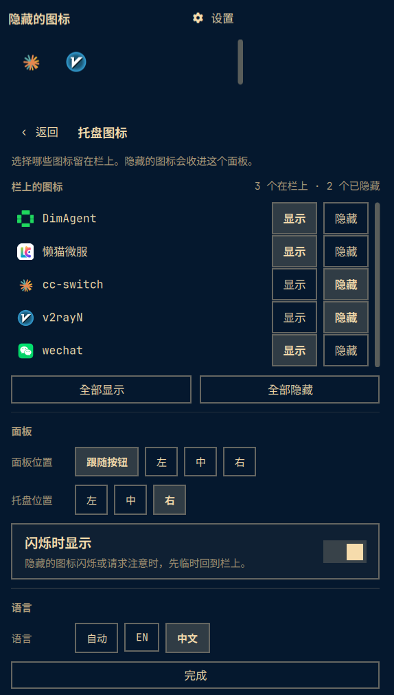

# Tray Panel

An Omarchy bar widget that keeps system tray icons on the bar and moves the
ones you hide into a Windows-style overflow panel.




## Features

- Tray icons live on the bar; a chevron at the end opens the overflow panel.
- Hide any icon and it moves into the panel instead of disappearing.
- Left click the chevron for the hidden icons, right click for the settings.
- Settings for every icon (show/hide), the panel position (at button / left /
  centre / right), the widget's bar section (left / centre / right),
  reveal-on-attention and the language (auto / English / 中文), laid out as a
  form: an icon list with a Show/Hide chip pair per icon, Show all / Hide all,
  then grouped sections (panel position and bar section as chip rows,
  reveal-on-attention as a switch row). Captions are measured rather than
  hard-coded, so the English labels ("Panel position") line up with the Chinese
  ones instead of running under the chips, and the icon list is sized from what
  the rest of the form leaves over so the Done button always stays on the card.
- A hidden icon comes back onto the bar while it wants attention, either the
  standard StatusNotifierItem way (`Status == NeedsAttention`) or by flashing
  its icon on a timer — WeChat flips its tray icon every 500 ms and never
  touches `Status`, so a status-only check would never fire for it.
- Full tray interaction survives in both surfaces: left click activates, right
  click opens the app's own menu — rendered in place, submenus included —
  middle click secondary-activates, and the wheel is forwarded.
- Works on horizontal and vertical bars, and on every bar edge.

## Install

```bash
omarchy plugin add https://github.com/omakits-x/omarchy-tray-panel.git --enable --yes
```

No manual edits to `~/.config/omarchy/shell.json` are required.

## Update

```bash
omarchy plugin update io.github.omakitsx.tray-panel --yes
```

## Remove

```bash
omarchy plugin remove io.github.omakitsx.tray-panel --yes
```

Removing the plugin restores Omarchy's built-in system tray.

## Usage

| Action | Result |
|---|---|
| Left click the chevron | Open the overflow panel (hidden icons) |
| Right click the chevron | Open the panel on its settings view |
| Left click an icon | Activate it |
| Right click an icon on the bar | Its own menu, anchored to that icon |
| Right click an icon in the panel | Its own menu, rendered inside the panel |
| Middle click | Secondary activate |
| Wheel | Forwarded to the item |

## Settings

Settings live inline in the widget's `shell.json` entry:

```json
{
  "id": "io.github.omakitsx.tray-panel",
  "hidden": ["app_status_icon_1"],
  "panelPlacement": "button",
  "revealOnAttention": true,
  "language": "auto"
}
```

- `hidden` — tray item ids that move into the overflow panel. Every other icon
  stays on the bar. Unknown ids are kept, so an app that is not running keeps
  its setting.
- `panelPlacement` — `button` (under the chevron), `left`, `center`, `right`.
- `revealOnAttention` — `true` (default) brings a hidden icon back onto the bar
  while it asks for attention, through either detection path. Detection is
  event driven: it hooks `iconChanged`, which the shell emits from the
  `NewIcon` signal the app already sends, so there is no polling and only
  hidden icons are watched.
- `language` — `auto` (follow the locale), `en`, `zh`.

The bar section is not stored here: choosing one in the settings runs
`omarchy bar move io.github.omakitsx.tray-panel --section <section>`, so the
widget moves exactly as it would from the CLI.

## Development

```bash
omarchy plugin validate .
npm test
qmllint -I "$OMARCHY_PATH/shell" *.qml
omarchy restart shell   # required: plugin QML is not hot-reloaded
```

Editing plugin QML does not reach the running shell. The plugin watcher does
log `Local plugin changed, reloading: <id>`, but the widget keeps running the
component it was created from: `Qt.clearComponentCache` is not a function in
this Qt build, so Omarchy's reload re-uses the cached compilation and the new
code never runs. A `preview` edit therefore looks like a no-op until
`omarchy restart shell` (the bar flickers for a second). Verified on Omarchy
Quattro with Quickshell 0.3.1: a `console.log` added to `BarWidget.qml` never
appeared in `qs log` after a file change, and did after a restart.

## Notes for plugin authors

Two platform behaviours cost the most time while building this plugin; both are
recorded in the `omarchy-plugin` skill with reproduction and fix:

- `QtQuick.Controls` types such as `ScrollBar` **do** resolve inside a
  third-party plugin. An early `ScrollBar is not a type` failure here was a
  stale QML disk cache replaying a broken first compile, not a real limitation:
  the plugin kept failing identically until `~/.cache/quickshell/qmlcache` was
  deleted and the shell restarted. Clear the cache before believing a type is
  missing. (The hand-rolled `ScrollHint.qml` used by the menu view predates that
  discovery; the panel's two views now use a real, draggable `ScrollBar` with
  `policy: AsNeeded`, so nothing shows while the icons fit.)
- `SystemTray.items.values` is list-like, not a real JS `Array`, so
  `Array.isArray()` returns false and any partition built on it silently
  produces nothing — the widget then renders as `visible: false` with no error.

## Credits

The tray icon rendering, menu drill-down and menu-row markup derive from
Omarchy's MIT-licensed `Tray.qml`; the plugin keeps that licence.

## License

MIT. See [LICENSE](LICENSE).
